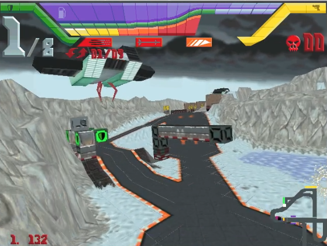
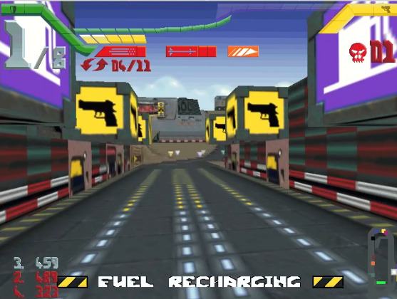
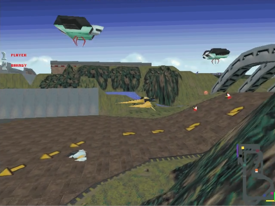

# hi-octane202x
My attempt to recreate useable source code for one of my most favorite games from my childhood (Hi-Octane by Bullfrog), because I always wanted to learn more about the internals of 3D games, and how the original game could have worked inside.

This source code will only run if the user does possess and supply it with the original game data files.



## Getting Started

#### Prerequisites
- game data
- cmake
- Irrlicht 1.8.5
- SFML 2.6.2
- libADLMIDI 1.5.1

The library versions listed above are known to result in successful compilation. Other library versions may work too.

#### Compile
Change to the `build` directory and run
```bash
cmake -DCMAKE_BUILD_TYPE=Release ..
make
```
A successful build will place the `hi-octane202x` binary in the build directory.

#### Run
After copying the game data files into `build/originalgame`, you can run the game by invoking `./hi-octane202x` in the build directory. I was only able to test two different original versions of the game, and I am almost sure there are other versions out there which will at the beginning not work without further modifications.

#### Environment
I develop and test the source code using Linux and OpenGL. This means this combination will work most likely. I also did some test runs using a Windows Notebook using Visual Studio Community and MSVC compiler, which also worked at this point in time. But because I can only do these tests from time to time compilation and running this program under Windows will be more prone to problems. Thank you for your understanding if something does not work one day.

The one time I tried to run the project using Direct3D failed. I hope one day I can fix this issue, but because OpenGL is working also under Windows this is not so important for me.


#### Acknowledgements
I would never have been able to start this project without the great work, effort and help from many people before me. A big thank you!
Many parts of the original game file formats were reverse engineered in the great "HiOctaneTools" project which can be also found on GitHub. 

Another valuable source of information was the DOS Game Modding Wiki. Especially regarding information about the sound, video and music files of
the game. This project is based on the Irrlicht Engine for output window creation and graphics. For sound and music I started to use the great SFML library.
Playing the original game music files was a pretty challenging task, and it took me a lot of investigations and attempts to make it work. At the end I succeded by combining source code of multiple great open source software projects and the libADLMIDI library. This software also takes care of OPL chip emulation that is necessary to play the original games music.


#### Current state
Unfortunetly the current state of the game is far from perfect or finished. It can be played, but there is much more need for further improvements and bugfixes. This project will be a longterm hobby for me, and I do not mind to continue working on it for the next years to come with changing development speed and progress. Please dont be too harsh about the quality of my source code, this is a hobby for me and I have more of an electronics background :) I will still have to learn a lot of new things to be able to continue with this project.

- Extraction of the original game data files works almost perfectly, I only have some small texture mapping issues at certain 3D models (for example the cone)
- Loading the original game levels does work, and the basic game mechanics are there. Some bugs still to be solved with triggering of terrain morphing
- Output is currently only in Windowed mode, 640x480 pixels. But later I want to try to implement Fullscreen and 1280x960 resolution.
- Please be aware that I did not try to implement the original controls of the game, the craft controls will work and feel different
- Unfortunetly the computer players are way too basic right now, this is the area where I will need to do most of the improvements in future
- I will need to decide what to do with collision detection between player crafts. I want collision detection, but the current solution slows computer players down
- Lightning is completely disabled right now. I first want to have a better playable version of the game, and then work at graphical improvements afterwards



#### Ideas for the future
- Fullscreen, 1280x960 resolution
- Implement Lightning (not sure yet what will be technically possible)
- Shadow mapping (the original game also seems to have some shadow calculations)
- Try to add multiplayer over Ethernet (I fear many code changes will be necessary for this)
- If possible add a level editor one day. The "HiOctaneTools" project already started working into this direction




