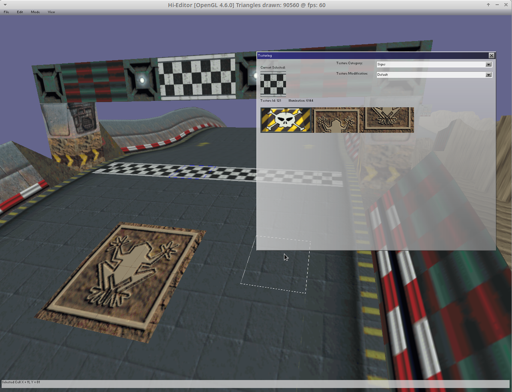

# hi-octane202x
My attempt to recreate useable source code for one of my most favorite games from my childhood (Hi-Octane by Bullfrog). First I want to recreate the original game as close as I can, and afterwards I want to see how much I can improve it further with newer technologies that were not available in 1995. This project can of course also be acting as a starting point for first modding of the original game. For this purpose I also started working on a level editor which is also contained within this project. 

This source code will only run if the user does possess and supply it with the original game data files.


## Getting Started

#### Prerequisites
- game data
- cmake
- Irrlicht 1.8.5
- SFML 2.6.2
- libADLMIDI 1.5.1

The library versions listed above are known to result in successful compilation. Other library versions may work too.

#### Compile
Change to the `build` directory and run
```bash
cmake -DCMAKE_BUILD_TYPE=Release ..
make
```
A successful build will place the `hi-octane202x` and `hi-editor` binary in the build directory.

#### Run
After copying the game data files into `build/originalgame`, you can run the game by invoking `./hi-octane202x` in the build directory. I was only able to test two different original versions of the game, and I am almost sure there are other versions out there which will at the beginning not work without further modifications. If this is the case please let me know, so that I can try to hopefully fix the issue.

#### Data extraction
During the first start of the game the original games data is extracted into subfolder `build/extract`, and then loaded from there. If for any reason an error occured during first data extraction, and you want to try again, or you want to reextract the data again, you only need to erase the subfolder `build/extract`, and restart the game. Every time the game is started it checks if this subfolder is still present. If this is not the case then all the data is extracted again.

Please do not delete the original games folder, even after data extraction it is still needed afterwards during each start of the project.

#### Environment
I develop and test the source code using Linux and OpenGL. This means this combination will work most likely. I also did some test runs using a Windows Notebook using Visual Studio Community and MSVC compiler, which also worked at this point in time. But because I can only do these tests from time to time compilation and running this program under Windows will be more prone to problems, and will most likely not work all the time. Thank you for your understanding if something does not work one day. This project is only a hobby for me, and sometimes my energy and time is very limited.

The one time I tried to run the project using Direct3D failed. I hope one day I can fix this issue, but because OpenGL is working also under Windows this is not so important for me.


#### hi-editor

The level editor is also part of this project and shares the lower level source code with the game itself. You can run the editor by invoking `./hi-editor` in the build directory. The editor is work in progress, and currently allows to change map textures (both Terrain and Columns), and to remove/add and modify columns in the level. All other functionality (terrain editing, Entities...) will be added over time. Also the user interface has only been started, and many functions are still not implemented.




#### Acknowledgements
I would never have been able to start this project without the great work, effort and help from many people before me. A big thank you to everybody that made this
project possible! Many parts of the original game file formats were reverse engineered in the great "HiOctaneTools" project which can be also found on GitHub. My first steps were directly based on the original C# source code of this project, and I started to develop everything else based on this some years ago.

Another valuable source of information was the DOS Game Modding Wiki. Especially regarding information about the sound, video and music files of
the game. This project is based on the Irrlicht Engine for output window creation and graphics. For sound and music I started to use the great SFML library.
Playing the original game music files was a pretty challenging task, and it took me a lot of investigations and attempts to make it work. At the end I succeded by combining source code of multiple great open source software projects and the libADLMIDI library. This software also takes care of OPL chip emulation that is necessary to play the original games music.

Last but not least I want to thank my wife, my two children, and my family for letting me spend many many hours working on this project.


#### Current state
The current state of the game is far from perfect or finished. It can be played, but there is more need for further improvements and bugfixes. Please dont be too harsh about the quality of my source code, this is a hobby for me and I have more of an electronics background :) I hope I keep improving and learning over time.

- Extraction of the original game data files works almost perfectly, I only have some small texture mapping issues at certain 3D models (for example the cone)
- Loading the original game levels does work, and the basic game mechanics are there. Some bugs still to be solved with triggering of terrain morphing
- Output is currently only in Windowed mode, 640x480 pixels. Later I want to implement Fullscreen and 1280x960 resolution. The level editor already uses the higher resolution. 
- Please be aware that I did not try to implement the original controls of the game, the craft controls will work and feel different
- Unfortunetly the computer players are way too basic right now, this is the area where I will need to do most of the improvements in future
- I will need to decide what to do with collision detection between player crafts. I want collision detection, but the current solution sometimes slows computer players down
- Lightning is completely disabled right now. I first want to have a better playable version of the game, and then work at graphical improvements afterwards


#### Ideas for the future
- Fullscreen, 1280x960 resolution (level editor already uses higher resolution)
- Implement Lightning (not sure yet what will be technically possible)
- Shadow mapping (at least that the craft have real time shadows)
- Try to add multiplayer over Ethernet


