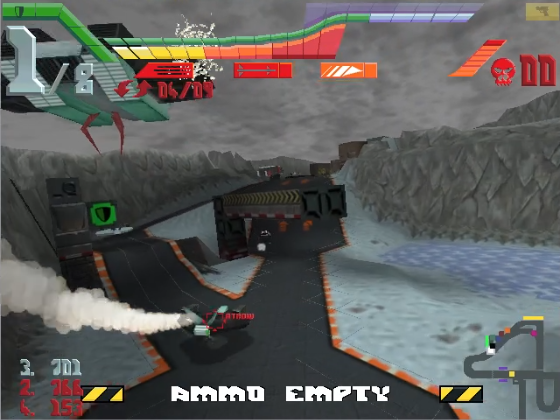
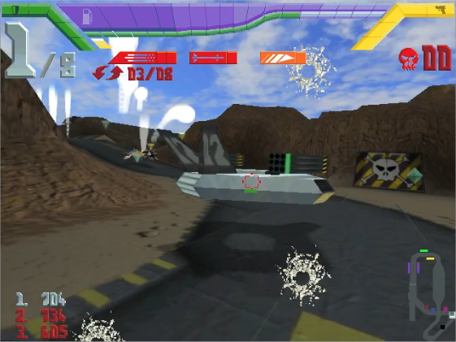
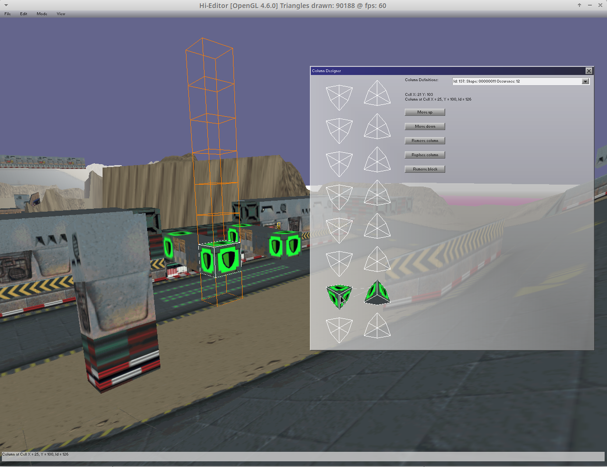
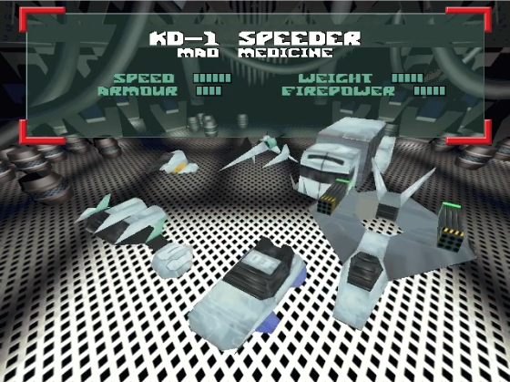
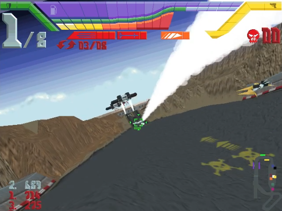
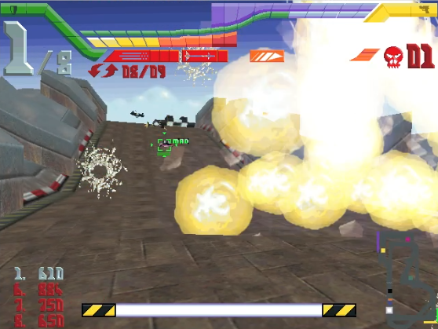

# hi-octane202x
I am currently recreating source code for one of my most favorite games from my childhood (Hi-Octane by Bullfrog). First step is to clone the original game as close as I can, and secondly as an option try to improve on the original as far as I am able to. This should also open the possibility for modding in the future. For this purpose I also started working on a level editor which is also contained within this project. 

If you want to help in any way, or you have ideas or feedback please let me know.

This source code will only run if the user does possess and supply it with the original game data files.



## Getting Started

#### Prerequisites
- game data
- cmake
- Irrlicht 1.8.5
- SFML 2.6.2
- libADLMIDI 1.5.1
- freetype2 2.10.4

The library versions listed above are known to result in successful compilation. Other library versions may work too. If you have problems with the freetype library or you do not want to use it you can comment out the define for `USE_FREETYPE` in file `definitions.h`. Only drawback will be that Irrlicht has to fall back on the integrated Gui font, which is very small and therefore could be difficult to read.

#### Compile
Change to the `build` directory and run
```bash
cmake -DCMAKE_BUILD_TYPE=Release ..
make
```
A successful build will place the `hi-octane202x` and `hi-editor` binary in the build directory.

#### Run
After copying the game data files into `build/originalgame`, you can run the game by invoking `./hi-octane202x` in the build directory. I was only able to test two different original versions of the game, and I am almost sure there are other versions out there which will at the beginning not work without further modifications. If this is the case please let me know, so that I fix the issue.

#### Data extraction
During the first start of the game the original games data is extracted into subfolder `build/extract`, and then loaded from there. If for any reason an error occured during first data extraction, and you want to try again, or you want to reextract the data again, you only need to erase the subfolder `build/extract`, and restart the game. Every time the game is started it checks if this subfolder is still present. If this is not the case then all the data is extracted again.

Please do not delete the original games folder, even after data extraction it is still needed afterwards during each start of the project.

#### Environment
I mainly develop and test under Linux using OpenGl. This means in this environment the project will compile most likely. From time to time I do additional test runs using a Windows Notebook using Visual Studio Community and MSVC compiler, and in most cases I have to first fix smaller issues again. This means compiling this project under Windows will be more prone to problems, and will most likely not work all the time without small issues. Thank you for your understanding if something does not work one day.

Irrlicht technically would also support Direct3D, but the only attempt I tried failed. But because Direct3D is not significant for me, I will postpone solving this issue to the distant future.



#### hi-editor

The level editor is also part of this project and shares the lower level source code with the game itself. You can run the editor by invoking `./hi-editor` in the build directory. The editor is also still work in progress, and currently allows the following operations:

- Change map textures (both Terrain and Columns)
- Remove/add and modify columns in the level
- Most basic terrain height modification (function will be extended in future)
- Add/Remove/Move entities
- Add/Remove/Change regions on the map (Charging stations, Position of race start location)

I will continue to add and improve existing functions.




#### Acknowledgements
I would never have been able to start this project without the great work, effort and help from many people before me. A big thank you to everybody that made this
project possible! Many parts of the original game file formats were reverse engineered in the great "HiOctaneTools" project which can be also found on GitHub. My first steps were directly based on the original C# source code of this project, and I started to develop everything else based on this some years ago.

Another valuable source of information was the DOS Game Modding Wiki. Especially regarding information about the sound, video and music files of
the game. This project is based on the Irrlicht Engine for output window creation and graphics. For sound and music I started to use the great SFML library.
Playing the original game music files was a pretty challenging task, and it took me a lot of investigations and attempts to make it work. At the end I succeded by combining source code of multiple great open source software projects and the libADLMIDI library. This software also takes care of OPL chip emulation that is necessary to play the original games music.

Last but not least I want to thank my wife, my two children, and my family for letting me spend many many hours working on this project.



#### Current state
The game development is still work in progress. It can be played, but there is more need for further improvements and bugfixes.

- Extraction of the original game data into usable file formats is working
- Loading the original game levels does work, and the basic game mechanics are there.
- Output is currently in Windowed mode, 640x480 pixels (vanilla) or 1280x960 resolution. The level editor always uses the higher resolution.
- I already added the possibility to enable shadows and an improved sky. I am currently try to learn more aber shaders and use them for further improvements 
- Please be aware that I did not try to implement the original controls of the game, the craft controls will work and feel different
- Unfortunetly the computer players are way too basic right now, this is the area where I will need to do most of the improvements in future



#### Ideas for the future
- Try to add dynamical lighting effects, and maybe utilize shaders
- Try to add multiplayer over Ethernet


