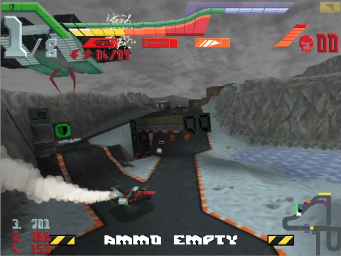
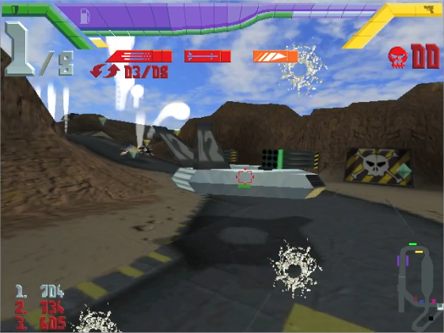
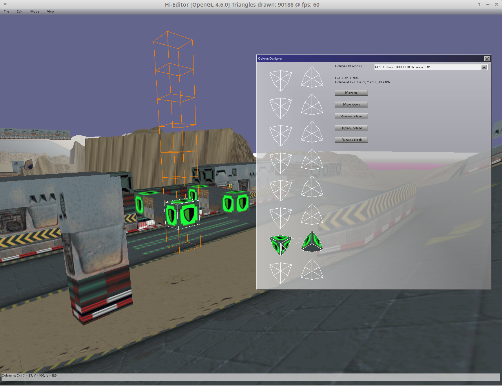
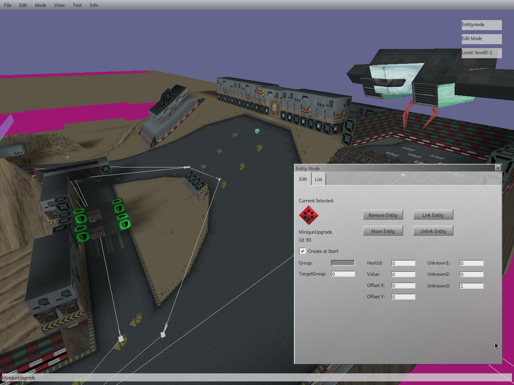
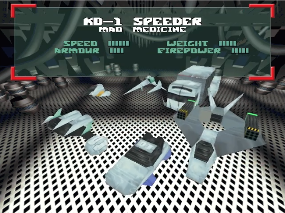
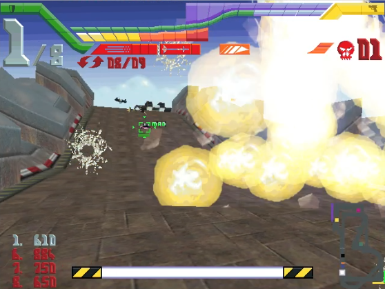

# hi-octane202x
I am currently recreating source code for one of my most favorite games from my childhood (Hi-Octane by Bullfrog). First step is to clone the original game as close as I can, and secondly as an option try to improve on the original as far as I am able to. This should also open the possibility for modding in the future. For this purpose I also started working on a level editor which is also contained within this project. 

If you want to help in any way, or you have ideas or feedback please let me know.

This source code will only run if the user does possess and supply it with the original game data files.

### Update 06.09.2026
Since beginning of this year I am in the process of replacing my own older source code with new source code more or less based on the
original games implementation. This will make my project feel much closer to the original. Right now the project contains old source code and
new implementations in parallel, and in the near future I will beginn to remove old now unnecessary parts step by step.

I made a lot of progress over the last 4 months or so. This is already implemented:

#### Current state
- Extraction of the original game data into usable file formats is working
- Vehicle physics according to original game (Right now runs at ~50ms update period as the Playstation 1 version, will increase update rate later)
- Booster, Machinegun, and Rocket Gun is implemented and working. Attacking players is working
- Player stats (Health, Fuel, Ammo) and Recharging stations are working
- HUD during the race is working
- Recovery vehicles are working
- Computer player steering (basic function working, but there must be a hidden bug somewhere I need to fix, so not perfect)
- Computer players also attack the human player now
- Auto Target System (so other players can be targeted)
- First effects are implemented (Smoke, Small/Medium Explosions)

#### TODO
- "Demo" mode with external cameras is not yet working as expected (external camera control code not yet implemented)
- Cones need to be implemented again, Same is true for steam effects at the race track
- Calculation of player rating not yet implemented
- Special bonus calculations (180°, 360°, Supercar) not yet implemented
- Broken glass effect on HUD not implemented currently
- Rocket Gun triggers in levels not working currently

Because of this huge rework this also means the main branch of this game is right now only partly playable. But I will try to fix the game
as fast as possible over the upcoming months. Thank you for your understanding and patience.

Another note: I have not tried to compile the current reworked game under Windows and Visual Studio for a long time. Because of the huge changes I expect Visual
Studio could currently throw a lot of different warnings/errors regarding type conversions and so on... Maybe the project does not compile at all right now, without
additional changes. I plan to do this after the reworked game is really playable again under my Linux system.



## Getting Started

#### Prerequisites
- game data
- cmake >= 3.10
- Irrlicht 1.8.5
- SFML >= 3.0.1
- libADLMIDI 1.5.1
- freetype2 2.10.4

The library versions listed above are known to result in successful compilation. Other library versions may work too. If you have problems with the freetype library or you do not want to use it you can comment out the define for `USE_FREETYPE` in file `definitions.h`. Only drawback will be that Irrlicht has to fall back on the integrated Gui font, which is very small and therefore could be difficult to read.

#### Prepare
- copy the original game data to `build/originalgame`
- copy `HIOCTANE.CD` to `build/orginalgame/hioctane.cd`

#### Compile
```sh
cmake -DCMAKE_BUILD_TYPE=Release -B build
make install
```
A successful build will place the `hi-octane202x` and `hi-editor` binary in the build directory.
#### Run
```sh
cd build
./hi-octane202x
```
I was only able to test two different original versions of the game, and I am almost sure there are other versions out there which will at the beginning not work without further modifications. If this is the case please let me know, so that I fix the issue.

#### Data extraction
During the first start of the game the original games data is extracted into subfolder `build/extract`, and then loaded from there. If for any reason an error occured during first data extraction, and you want to try again, or you want to reextract the data again, you only need to erase the subfolder `build/extract`, and restart the game. Every time the game is started it checks if this subfolder is still present. If this is not the case then all the data is extracted again.

Please do not delete the original games folder, even after data extraction it is still needed afterwards during each start of the project.

#### Environment
I mainly develop and test under Linux using OpenGL. This means in this environment the project will compile most likely. From time to time I do additional test runs using a Windows Notebook using Visual Studio Community and MSVC compiler, and in most cases I have to first fix smaller issues again. This means compiling this project under Windows will be more prone to problems, and will most likely not work all the time without small issues. Thank you for your understanding if something does not work one day.

Irrlicht technically would also support Direct3D, but the only attempt I tried failed. But because Direct3D is not significant for me, I will postpone solving this issue to the distant future.



#### hi-editor

The level editor is also part of this project and shares the lower level source code with the game itself. You can run the editor by invoking `./hi-editor` in the build directory. The editor is also still work in progress, and currently allows the following operations:

- Change map textures (both Terrain and Columns)
- Remove/add and modify columns in the level
- Most basic terrain height modification (function will be extended in future)
- Add/Remove/Move entities
- Add/Remove/Change regions on the map (Charging stations, Position of race start location)

I will continue to add and improve existing functions.





#### Acknowledgements
I would never have been able to start this project without the great work, effort and help from many people before me. A big thank you to everybody that made this
project possible! Many parts of the original game file formats were reverse engineered in the great "HiOctaneTools" project which can be also found on GitHub. My first steps were directly based on the original C# source code of this project, and I started to develop everything else based on this some years ago.

I really want to thank aybe for giving me the opportunity to look much deeper into the original game inner workings as I was ever able before.
Without this support I would not have been able to rework the project completely starting of 2026, and then the final outcome would never have
reached a level that is acceptable at the end.

Another valuable source of information was the DOS Game Modding Wiki. Especially regarding information about the sound, video and music files of
the game. This project is based on the Irrlicht Engine for output window creation and graphics. For sound and music I started to use the great SFML library.
Playing the original game music files was a pretty challenging task, and it took me a lot of investigations and attempts to make it work. At the end I succeded by combining source code of multiple great open source software projects and the libADLMIDI library. This software also takes care of OPL chip emulation that is necessary to play the original games music.

Last but not least I want to thank my wife, my two children, and my family for letting me spend many many hours working on this project.




#### Ideas for the future
- Try to add dynamical lighting effects, and maybe utilize shaders
- Try to add multiplayer over Ethernet


